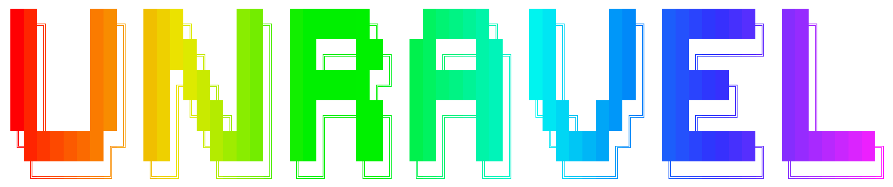

#### UN-biased high-Resolution Analysis and Validation of Ensembles using Light sheet images 

UNRAVEL is a command line tool for:
* Voxel-wise analysis of fluorescent signals (e.g., c-Fos immunofluorescence) across the mouse brains in atlas space
* Validation of hot/cold spots via cell/label density quantification at cellular resolution

## Publications: 
* UNRAVELing the synergistic effects of psilocybin and environment on brain-wide immediate early gene expression in mice 
    * [Neuropsychopharmacology](https://www.nature.com/articles/s41386-023-01613-4)

## IF/iDISCO+/LSFM guide: 
[Heifets lab guide to immunofluorescence staining, iDISCO+, & lightsheet fluorescence microscopy](https://docs.google.com/document/d/16yowBhiBQWz8_VX2t9Rf6Xo3Ub4YPYD6qeJP6vJo6P4/edit?usp=sharing)

## UNRAVEL guide: 
* Example workflow for region-wise and voxel-wise c-Fos+ cell densities:
    * prep_reg.py
    * copy_tifs.py
    * brain_mask.py
    * reg.py
    * check_reg.py
    * regional_cell_densities.py
    * regional_cell_densities_summary.py
    * prep_vstats.py
    * z-score.py
    * aggregate_files_from_sample_dirs.py
    * whole_to_LR_avg.py
    * vstats.py
    * fdr_range.py
    * fdr.py
    * recursively_mirror_rev_cluster_indices.py
    * ilastik_pixel_classification.py
    * validate_clusters.py
    * valid_clusters_summary.py

\
Please send questions/suggestions to:
* Daniel Ryskamp Rijsketic (danrijs@stanford.edu)
* Austen Casey (abcasey@stanford.edu)
* Boris Heifets (bheifets@stanford.edu)

\
For command line interface help, please review [Unix tutorials](https://andysbrainbook.readthedocs.io/en/latest/index.html)